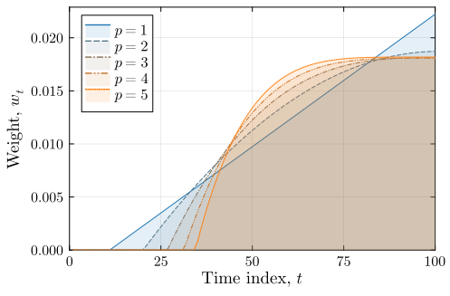

# Don't Look Back in Anger
Repository accompanying the&nbsp;paper:

***Don't Look Back in Anger: Wasserstein Distributionally Robust Optimization with Nonstationary&nbsp;Data***

## Abridged Paper Abstract
We study data-driven decision problems where historical observations are generated by a time-evolving distribution whose consecutive shifts are bounded in Wasserstein distance. We address this nonstationarity using a distributionally robust optimization model with an ambiguity set that is a Wasserstein ball centered at a weighted empirical distribution, thereby allowing for the time decay of past data in a way which accounts for the drift of the data-generating distribution. Our main technical contribution is a concentration bound for weighted empirical distributions that explicitly captures both the effective sample size (i.e., the equivalent number of equally weighted observations) and the distributional drift. Using our concentration bound, we select observation weights that optimally balance variance, determined by the effective sample size, and drift, induced by the temporal changes in the data-generating process. The family of optimal weightings reveals a polynomial relationship between the order of the Wasserstein ambiguity ball and the time-decay profile of the optimal weights. Numerical experiments demonstrate the effectiveness of our proposed&nbsp;approach.

## Description
This repository provides implementations of our numerical tests on a distributionally robust newsvendor problem, an interior-point solver for observation weights that optimally balance variance and drift, and a sampler which visualises ambiguity&nbsp;sets.

The following image (Figure&nbsp;2 of the paper) shows an example of the optimal observation weights.

For full details, see Subsection&nbsp;4 of the&nbsp;paper.

## Dependencies
You must install a recent version of Julia from http://julialang.org/downloads/. The paper uses&nbsp;Julia&nbsp;1.12.

A number of Julia packages are required. They can be added by&nbsp;commanding:

`using Pkg;  Pkg.add.(["Random"; "Distributions"; "Statistics"; "StatsBase"; "JuMP"; "MathOptInterface"; "Gurobi"; "Ipopt"; "IterTools"; "ProgressBars"; "Plots"; "Measures"; "CSV"])`.*

*Note that a license for the Gurobi solver is also required; see https://www.gurobi.com/solutions/licensing/. The paper uses&nbsp;Gurobi&nbsp;13.0.

## Reproducing Output from the Paper
You can reproduce the following figures by commanding the&nbsp;following:
- Figure&nbsp;1: `include("plot-ambiguity-sets.jl")`
- Figure&nbsp;2: `include("plot-weights.jl")`
- Figure&nbsp;3: `include("process-train-and-test-multi-modal-drifting-newsvendor-data.jl")`

*Note that Figure&nbsp;3 relies on data files generated by the script "generate-train-and-test-multi-modal-drifting-newsvendor-data.jl". This is designed to run in a high-performance computing environment using the "doit.pbs" job submission script and 13000 jobs. The data files are too numerous to host on GitHub, but are available from&nbsp;https://osf.io/s52zp/overview?view_only=d8e9e2fc8c48433692c94a68cc265c5a.

The script `weights.jl` provides an implementation of an interior-point solver for computing observation weights that optimally balance variance and drift. For a Wasserstein distance--order `p`; a number of historical observations `T`; and a ratio of the drift bound to ambiguity ball size `ρ╱ε`, commanding `Wp_weights(p, T, ρ╱ε)` returns the optimal weights using the Ipopt&nbsp;solver.

## Thank You :pray:
